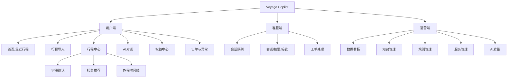
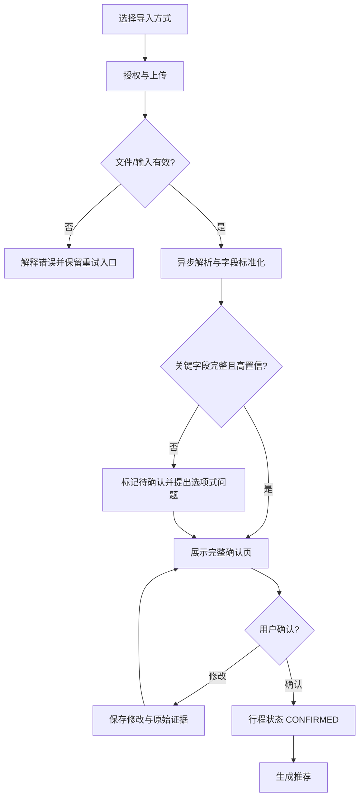
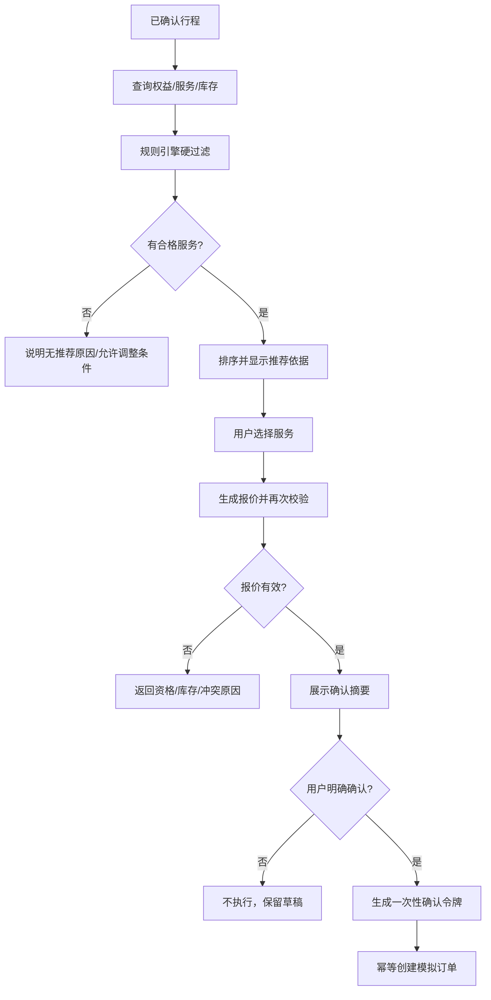
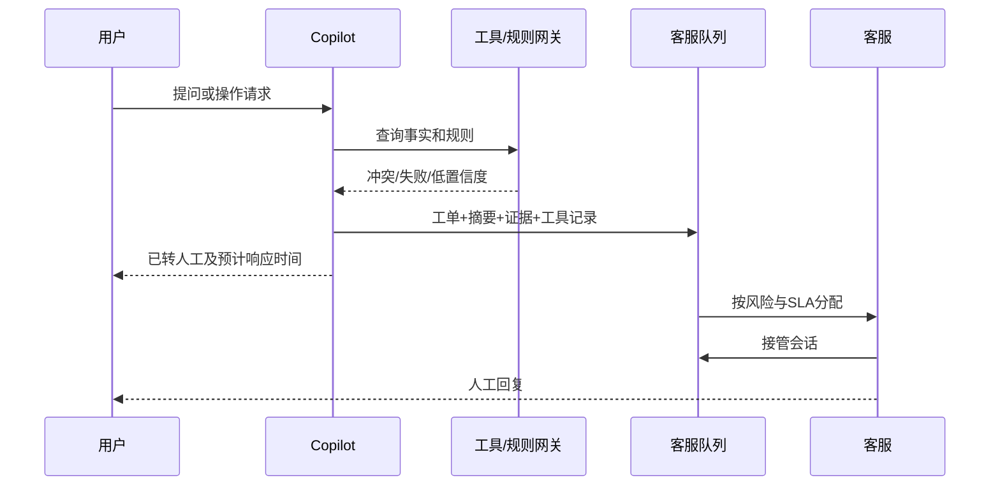

# Voyage Copilot 体验与流程设计

## 1. 体验原则

1. **先确认事实，再提供建议：** 关键行程字段未确认时，不进入交易链路。
2. **先给结论，再给依据：** 用户首先看到“能否使用、要付多少”，可展开规则和引用。
3. **建议不是承诺：** 推荐、库存和报价明确更新时间，模拟交易持续可见。
4. **风险操作显式确认：** 操作对象、结果和代价与主按钮放在同一视野。
5. **失败不丢上下文：** 任何降级和接管均保留行程、证据、对话和工具记录。
6. **减少认知负担：** 优先选项式澄清，避免让用户重复输入已知信息。

## 2. 核心Persona

### P1 高频商务旅客：林晨

- 35岁，每月出差2—3次，持有多个权益计划；
- 目标：快速确认本次能用什么，不愿阅读长规则；
- 痛点：航站楼变化、权益入口分散、时间紧；
- 设计要求：30秒内确认行程，推荐卡直接显示资格与距离。

### P2 家庭旅客：周女士

- 39岁，与配偶和儿童同行，低频出行；
- 目标：明确携伴、儿童收费和取消规则；
- 痛点：规则术语复杂，担心到场无法使用；
- 设计要求：同行结构可视化，费用拆分清楚，避免模糊表达。

### P3 客服专员：王宁

- 同时处理多个租户会话，关注SLA与风险；
- 目标：无需重复询问就能定位问题并处理；
- 痛点：订单、规则、用户诉求分散在不同系统；
- 设计要求：摘要与证据并列，清楚区分AI建议和已执行操作。

### P4 权益运营：陈可

- 管理规则、知识和服务状态；
- 目标：安全发布内容，定位低质量回答；
- 痛点：变更影响不可见、错误难复现；
- 设计要求：版本差异、测试结果、影响范围和回滚清晰。

## 3. 信息架构

## 4. 主用户旅程

| 阶段 | 用户目标 | 关键界面 | 系统行为 | 主要风险 |
|---|---|---|---|---|
| 进入 | 知道产品能做什么 | 首页 | 展示导入入口和模拟提示 | 误以为真实交易 |
| 导入 | 快速提交行程 | 导入页 | 上传、解析、进度 | 文件隐私、解析失败 |
| 确认 | 确认事实准确 | 确认页 | 标注证据和待确认字段 | AI编造、时区错误 |
| 发现 | 找到能用的权益 | 推荐页 | 规则过滤和排序 | 错误资格、库存陈旧 |
| 理解 | 弄清费用与限制 | 卡片/对话 | 展示来源和更新时间 | 引用错误、术语复杂 |
| 选择 | 组合合适服务 | 时间线 | 冲突检测和重算 | 缓冲不足 |
| 确认 | 理解操作后果 | 确认页 | 最终校验、确认令牌 | 未确认写操作 |
| 完成 | 获得凭证和下一步 | 订单页 | 生成模拟订单、提醒 | 状态不一致 |
| 异常 | 选择替代方案 | 异常页 | 影响分析、方案、转人工 | 过度承诺 |

## 5. 核心流程图

### 5.1 行程导入与确认

### 5.2 推荐到模拟订单

### 5.3 人工接管

## 6. 页面规格

### U01 首页

**目标：** 让用户理解价值并开始任务。  
**模块：** 顶部身份/模拟环境提示、导入主入口、最近行程、可用权益摘要、AI对话入口。  
**状态：** 无行程、存在待确认行程、存在活跃行程、存在紧急异常。  
**主CTA：** “导入行程”。异常存在时主CTA切换为“处理行程变化”。

### U02 行程导入

**模块：** 输入方式切换、上传区、文本/航班输入、隐私授权、示例与格式提示。  
**校验：** 类型、大小、页数、必填、航班号格式、日期范围。  
**反馈：** 上传与解析分阶段进度；用户离开后允许后台继续。

### U03 行程确认

**模块：** 原图/文本证据、航段卡、字段编辑、置信状态、同行设置。  
**交互：** 点击字段定位证据；待确认字段自动聚焦；保存修改不等于确认行程。  
**主CTA：** 所有关键字段有效后才可“确认并查看权益”。

### U04 推荐与时间线

**模块：** 行程摘要、偏好、推荐卡、无推荐解释、时间线。  
**推荐卡顺序：** 结论与理由 → 服务/时间/地点 → 费用/点数 → 规则摘要 → 更新时间。  
**交互：** 查看依据、加入时间线、选择替代项、发起问答。

### U05 AI对话

**模块：** 上下文条、消息流、引用、工具进度、快捷问题、转人工状态。  
**规则：** AI建议、规则事实、已执行动作使用不同标签；错误不使用“已完成”措辞。

### U06 订单确认/详情

**确认态：** 展示不可变摘要、报价倒计时、模拟交易说明和明确确认控件。  
**结果态：** 状态、虚拟凭证、地点与时间、取消规则、行程入口、问题入口。  
**异常态：** 影响说明、原订单可用性、方案比较、人工入口。

### C01 客服队列

字段：风险、SLA、等待时长、用户、租户、意图、行程、订单状态、接管人。支持按风险、SLA和租户筛选；不得默认跨租户展示内容。

### C02 客服详情

左侧会话，中间用户/行程/权益/订单，右侧摘要/依据/建议。已执行动作使用时间线，不与AI建议混排。接管、交还和升级均需记录操作者与时间。

### A01 规则/知识发布

列表显示状态、版本、有效期、影响范围、测试结果、创建人和审核人。详情支持Diff、测试用例、影响预览、定时发布和回滚。

## 7. 通用页面状态

每个页面必须设计：加载、空数据、部分数据、无权限、已失效、网络失败、服务降级、成功和不可恢复错误。所有错误状态包含用户可执行的下一步，不暴露内部堆栈或Prompt。

## 8. 内容与语气

- 使用“根据你的会员计划与本次行程……”而不是绝对承诺；
- 不确定时说“当前资料无法确认”，同时说明缺什么和下一步；
- 模拟订单持续显示“演示/不产生真实交易”；
- 金额和点数分别显示，不使用含糊的“免费”；
- 航班和服务时间必须附当地日期、时间和时区；
- 紧急信息说明变化、影响、截止时间和所需动作。

## 9. 原型覆盖

[低保真交互原型](prototype/index.html)覆盖：首页、导入、确认、推荐、AI解释、订单确认与成功、异常方案、客服接管。该原型用于流程和状态评审，不代表最终视觉设计。
