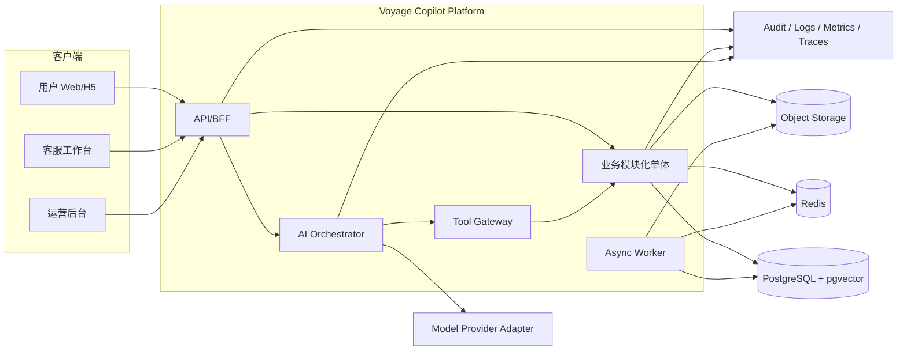
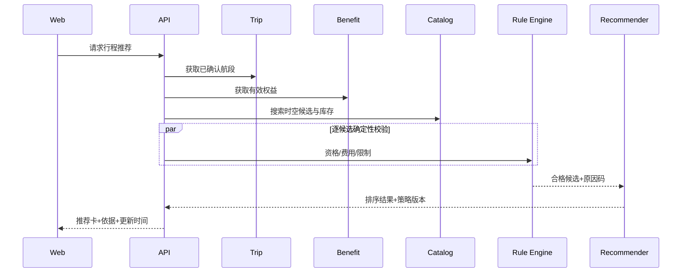
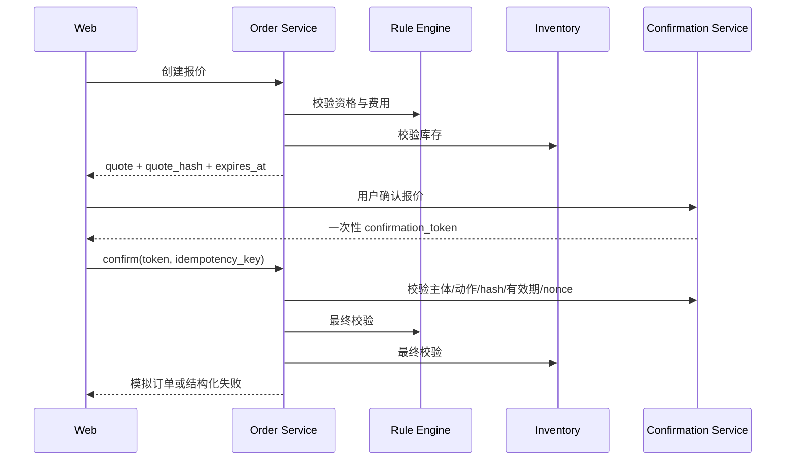
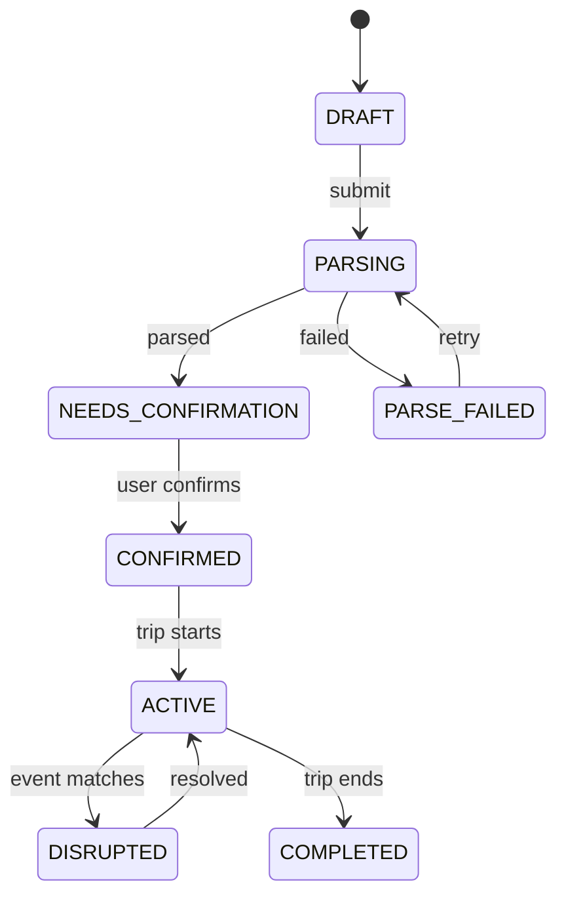

# Voyage Copilot 系统设计

## 1. 架构目标

- 支撑三端同源业务能力和多租户隔离；
- 把AI的不确定性限制在理解、解释和编排层；
- 保证规则和订单确定性、幂等性与可审计；
- 在MVP阶段保持低运维复杂度，同时保留拆分边界；
- 支持模型、Prompt、规则、知识和推荐策略独立版本与回滚。

## 2. 技术基线

| 层 | 推荐技术 | 说明 |
|---|---|---|
| Web | Next.js、TypeScript、React Query | 三端独立应用，共享UI和契约 |
| API | FastAPI、Pydantic、SQLAlchemy | 模块化单体，结构化AI集成 |
| Worker | Dramatiq/Celery | 文档、解析、提醒、评测异步任务 |
| 数据 | PostgreSQL、pgvector | 事务、规则、向量检索 |
| 缓存 | Redis | 缓存、限流、短期状态、队列 |
| 文件 | S3兼容对象存储 | 行程源文件和知识文档 |
| 认证 | OIDC、RBAC | 登录、角色、租户scope |
| 观测 | OpenTelemetry | 日志、指标和分布式Trace |
| 部署 | Docker、托管容器 | dev/test/staging/prod隔离 |

## 3. 容器关系图



## 4. 后端模块

| 模块 | 聚合/对象 | 对外能力 |
|---|---|---|
| Identity | Tenant、User、Role、Consent | 身份、权限、授权与删除请求 |
| Trip | Trip、Segment、Traveler、Evidence | 导入、解析、编辑、确认 |
| Benefit | Plan、Benefit、Entitlement、Ledger | 权益和余额查询 |
| Rule | Rule、Version、Evaluation | 判断、测试、发布、回滚 |
| Catalog | Supplier、Service、Location、Inventory | 搜索、营业、库存、状态 |
| Recommend | Run、Candidate、Strategy | 硬过滤、评分、原因 |
| Timeline | Plan、Slot、Conflict | 时间组合和冲突检测 |
| Knowledge | Document、Chunk、Citation | 入库、检索、引用 |
| Conversation | Conversation、Message、ModelRun | 对话和上下文 |
| Order | Quote、Order、Confirmation、LedgerEntry | 报价、确认、状态机 |
| Disruption | Event、Impact、Option、Action | 模拟异常处理 |
| Support | Handoff、Ticket、SLA、Assignment | 接管和工单 |
| Analytics | Event、Metric、Experiment | 埋点和聚合 |
| Audit | AuditEntry | 追加写审计 |

模块间只通过应用服务或领域事件访问，不直接跨模块修改表。

## 5. 核心序列

### 5.1 推荐生成



### 5.2 确认模拟订单



## 6. 关键状态机



订单状态机以[业务规则规格](03-BUSINESS-RULES.md)为准。

## 7. 多租户与授权

- 所有业务主表包含 `tenant_id`，数据库查询层强制租户过滤；
- 服务端从已验证会话构建 `AuthContext`，拒绝客户端或模型覆盖租户；
- PostgreSQL可启用Row Level Security作为纵深防御；
- 缓存键、对象存储路径、向量元数据和日志均带租户范围；
- 客服访问由租户、队列、工单分配和字段级权限共同决定；
- 审计日志记录主体、角色、租户、动作、资源、结果、IP/设备摘要和Trace ID。

## 8. 一致性与可靠性

- 订单和点数台账在同一数据库事务中提交；
- 领域事件使用Transactional Outbox，Worker至少一次投递，消费方幂等；
- 状态更新使用版本号乐观锁；
- 外部模型与对象存储调用使用超时、有限重试和熔断；
- 工具错误分类为可重试、不可重试、需补信息、需人工；
- 解析、评测、知识入库支持任务续跑和死信队列；
- 报价、确认Token和库存快照有明确TTL。

## 9. 降级矩阵

| 故障 | 用户体验 | 系统动作 |
|---|---|---|
| LLM不可用 | 显示结构化权益和服务页 | 禁用对话生成，保留规则查询 |
| 多模态解析失败 | 切换文本/手工输入 | 保留文件与失败原因 |
| RAG不可用 | 仅回答结构化事实 | 不生成需文档依据的回答 |
| 规则不可用 | 停止资格与订单 | 创建重要工单 |
| 库存超时 | 显示暂时无法确认 | 禁止报价/确认 |
| 队列积压 | 显示处理中与任务状态 | 告警、限流、扩容 |
| 观测系统故障 | 核心查询可继续 | 写操作按审计可用策略降级/停止 |

## 10. 可观测性

一个用户任务使用统一 `trace_id` 串联HTTP、模型、检索、规则、工具和异步任务。关键指标包括：P95延迟、错误率、模型Token与成本、检索无结果、规则冲突、工具重试、确认拒绝、队列积压和跨租户拒绝。

日志采用结构化字段且默认脱敏；原始Prompt、上传内容和PII不得进入普通应用日志。

## 11. 部署与环境

```text
local → dev → test → staging → production
```

- 各环境独立数据库、存储桶、缓存、密钥和模型项目；
- Schema迁移向前兼容，发布后再清理废弃字段；
- 功能开关控制模型版本、推荐策略、写工具和异常能力；
- 规则、知识、Prompt和模型配置独立版本化；
- staging使用完整虚拟数据和生产等价安全策略。

## 12. 架构决策记录

开工前建立：ADR-001模块化单体、ADR-002模型适配层、ADR-003租户隔离、ADR-004规则表达、ADR-005确认令牌、ADR-006向量检索、ADR-007事件Outbox、ADR-008数据保留与删除。

