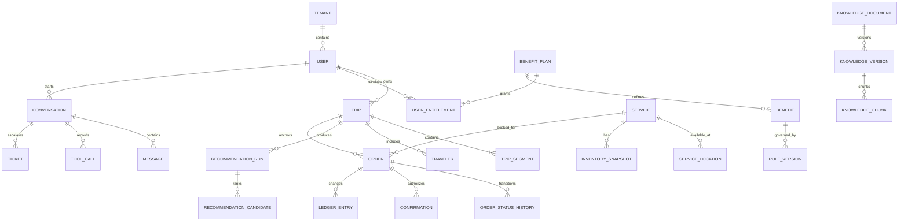

# Voyage Copilot 数据与API规格

## 1. 通用约定

- API前缀：`/api/v1`；JSON字段使用 `snake_case`；
- 标识符使用UUID/ULID，不暴露自增序号；
- 时间传ISO 8601并带时区，数据库保存UTC；机场本地时间同时保存IANA时区；
- 金额使用 `amount_minor + currency`；点数使用整数；
- 所有请求返回 `trace_id`；写请求支持 `Idempotency-Key`；
- 列表使用游标分页；错误使用稳定机器码和安全用户文案；
- API契约最终以OpenAPI文件为单一来源，前端类型由契约生成。

## 2. 关系模型



## 3. 核心字段字典

### 3.1 行程

| 表 | 关键字段 |
|---|---|
| `trips` | `id, tenant_id, user_id, status, locale, source_type, confirmed_at, version` |
| `trip_segments` | `trip_id, sequence, flight_number, departure_airport, arrival_airport, departure_at_utc, arrival_at_utc, departure_timezone, arrival_timezone, terminals, cabin, status` |
| `travelers` | `trip_id, display_name_encrypted, traveler_type, birth_date_encrypted, is_primary` |
| `trip_field_evidence` | `segment_id, field_name, parsed_value, confidence, source_locator, user_value, confirmed_by_user` |
| `trip_source_files` | `trip_id, object_key, mime_type, checksum, scan_status, retention_until` |

### 3.2 权益、规则和服务

| 表 | 关键字段 |
|---|---|
| `benefit_plans` | `tenant_id, code, name, valid_from, valid_to, status` |
| `benefits` | `plan_id, service_type, allowance_type, scope, status` |
| `user_entitlements` | `user_id, benefit_id, valid_from, valid_to, status` |
| `entitlement_ledger` | `entitlement_id, order_id, entry_type, quantity, balance_after, idempotency_key` |
| `rule_versions` | `rule_id, version, expression_json, priority, effective_from, effective_to, approval_status` |
| `rule_evaluations` | `subject_type, subject_id, input_snapshot_json, output_json, matched_versions, trace_id` |
| `services` | `supplier_id, service_type, name, duration_minutes, status, quality_score` |
| `service_locations` | `service_id, airport_code, terminal, zone, directions, timezone` |
| `inventory_snapshots` | `service_id, slot_start, capacity, available, observed_at, expires_at` |

### 3.3 订单、会话和知识

| 表 | 关键字段 |
|---|---|
| `orders` | `tenant_id, user_id, trip_id, service_id, use_at, status, points, amount_minor, currency, quote_hash, version` |
| `confirmations` | `order_id, action, subject_id, quote_hash, token_hash, expires_at, used_at` |
| `order_rule_snapshots` | `order_id, evaluation_id, snapshot_json` |
| `conversations` | `tenant_id, user_id, status, owner_type, risk_level, resolved_at` |
| `messages` | `conversation_id, actor_type, content_redacted, citations_json, created_at` |
| `tool_calls` | `conversation_id, tool_name, risk_level, request_redacted, result_code, source_versions, trace_id` |
| `knowledge_versions` | `document_id, version, object_key, metadata_json, effective_from, effective_to, approval_status` |
| `knowledge_chunks` | `version_id, section_path, content, embedding, token_count, metadata_json` |

## 4. P0 API清单

### 身份与授权

- `GET /me`：当前身份、租户、角色和数据范围；
- `POST /consents`：创建授权；
- `DELETE /consents/{type}`：撤回授权并启动相应处理；
- `POST /privacy/deletion-requests`：提交数据删除请求。

### 行程

- `POST /trips/imports`：创建导入任务；
- `GET /trip-imports/{job_id}`：查询解析状态；
- `GET /trips/{trip_id}`：获取行程和字段证据；
- `PATCH /trips/{trip_id}`：修改字段，要求版本号；
- `POST /trips/{trip_id}/confirm`：确认行程；
- `DELETE /trips/{trip_id}`：提交删除。

### 权益、服务、推荐

- `GET /me/entitlements`；
- `POST /eligibility/evaluations`；
- `GET /services/search`；
- `GET /services/{service_id}/availability`；
- `POST /trips/{trip_id}/recommendation-runs`；
- `POST /trips/{trip_id}/timeline-plans`。

### AI会话

- `POST /conversations`；
- `GET /conversations/{id}`；
- `POST /conversations/{id}/messages`：流式返回阶段、工具状态和答案；
- `POST /conversations/{id}/handoffs`。

### 模拟订单

- `POST /order-quotes`；
- `POST /orders/drafts`；
- `POST /orders/{id}/confirmation-tokens`；
- `POST /orders/{id}/confirm`；
- `POST /orders/{id}/change-quotes`；
- `POST /orders/{id}/cancel-quotes`；
- `POST /orders/{id}/cancel`；
- `GET /orders/{id}`。

### 客服与运营

- `GET /agent/conversations`、`POST /agent/conversations/{id}/takeover`；
- `GET/POST/PATCH /tickets`；
- `GET/POST/PATCH /admin/knowledge-documents`；
- `POST /admin/knowledge-versions/{id}/review|publish|rollback`；
- 规则和服务提供同等草稿、审核、发布、回滚接口。

## 5. 代表性请求与响应

### 5.1 资格评估

```json
{
  "trip_segment_id": "seg_demo_001",
  "entitlement_id": "ent_demo_008",
  "service_id": "svc_demo_023",
  "use_at": "2026-08-10T05:00:00Z",
  "party": {"adults": 1, "children": 1, "infants": 0}
}
```

```json
{
  "evaluation_id": "eval_demo_001",
  "status": "eligible_with_fee",
  "eligible": true,
  "points": 1,
  "amount_minor": 8000,
  "currency": "CNY",
  "reason_codes": ["ENTITLEMENT_ACTIVE", "CHILD_EXTRA_FEE"],
  "matched_rule_versions": ["rule_demo_017@3"],
  "evaluated_at": "2026-07-19T12:00:00Z",
  "trace_id": "trace_demo_001"
}
```

### 5.2 错误格式

```json
{
  "error": {
    "code": "RULE_CONFLICT",
    "message": "当前规则存在冲突，暂时无法确认资格。",
    "retryable": false,
    "action": "handoff",
    "details": {"ticket_id": "ticket_demo_002"}
  },
  "trace_id": "trace_demo_009"
}
```

## 6. 标准错误码

| 领域 | 错误码 |
|---|---|
| 身份 | `UNAUTHENTICATED, FORBIDDEN, TENANT_SCOPE_VIOLATION, CONSENT_REQUIRED` |
| 行程 | `INVALID_FILE, MALWARE_DETECTED, PARSE_FAILED, FIELD_CONFIRMATION_REQUIRED, TRIP_NOT_CONFIRMED, VERSION_CONFLICT` |
| 规则 | `RULE_NOT_FOUND, RULE_EXPIRED, RULE_CONFLICT, INPUT_INCOMPLETE` |
| 服务 | `SERVICE_CLOSED, TERMINAL_MISMATCH, INVENTORY_UNAVAILABLE, INVENTORY_STALE` |
| 订单 | `QUOTE_EXPIRED, QUOTE_CHANGED, CONFIRMATION_REQUIRED, TOKEN_INVALID, TOKEN_USED, INVALID_STATE, IDEMPOTENCY_CONFLICT` |
| AI | `MODEL_UNAVAILABLE, RETRIEVAL_EMPTY, EVIDENCE_CONFLICT, TOOL_FAILED, LOW_CONFIDENCE` |

## 7. 领域事件

事件信封：`event_id、event_type、version、tenant_id、occurred_at、actor、trace_id、payload`。P0事件：

- `trip.imported、trip.parsed、trip.confirmed`；
- `recommendation.generated、recommendation.exposed、recommendation.clicked`；
- `order.quoted、order.confirmed、order.cancelled、order.failed`；
- `disruption.detected、resolution.accepted`；
- `conversation.handoff_requested、ticket.created`；
- `rule.published、knowledge.published`。

## 8. 数据生命周期

- 原始行程文件默认保留30天，可由用户提前删除；
- 解析后的必要业务字段按试点策略保留；
- 对话内容脱敏后保留用于质量评估，原始敏感片段缩短保留；
- 审计和订单快照按合规策略保留且访问受限；
- 删除流程覆盖数据库、向量索引、对象存储、缓存和分析副本，并记录完成证明。

