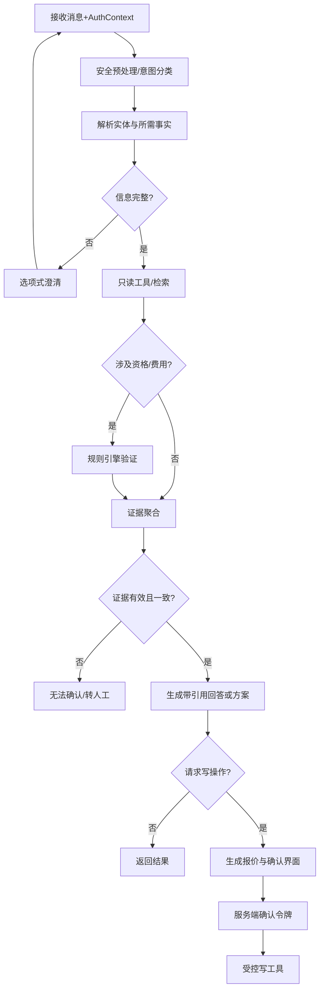

# Voyage Copilot AI、RAG与Agent设计

## 1. AI边界

| 能力 | 模型负责 | 确定性系统负责 |
|---|---|---|
| 行程 | 从图片/文本提取候选字段 | 格式校验、时区标准化、确认状态 |
| 问答 | 理解意图、组织自然语言 | 数据查询、规则结论、引用有效性 |
| 推荐 | 解释推荐理由 | 候选过滤、分数和排序 |
| 时间线 | 解释冲突和选项 | 时间计算、约束求解 |
| 订单 | 引导用户理解与确认 | 报价、令牌、状态机和台账 |
| 客服 | 生成摘要和处理建议 | SLA、分配、权限和已执行记录 |

模型不得生成业务事实、绕过规则、直接访问数据库、修改会员资格、自行赔偿、未经确认写订单或读取其他租户内容。

## 2. 有限状态AI工作流



## 3. 意图与状态

P0意图：导入/修改/确认行程、查询拥有权益、查询机场服务、解释资格/携伴/儿童/费用/取消、生成推荐、生成时间线、报价、创建/取消模拟订单、查询订单、请求人工、投诉/赔偿、异常方案。

对话状态保存 `active_trip_id、active_segment_id、selected_service_ids、active_quote_id、missing_slots、risk_flags、last_tool_results、handoff_status`。模型只读取必要摘要，不把完整历史无限放入上下文。

## 4. 工具目录与风险

| 风险 | 工具 | 自动化策略 |
|---|---|---|
| R0 | `get_trip, list_entitlements, evaluate_eligibility, search_services, get_availability, get_order, retrieve_knowledge` | 权限和参数通过后自动 |
| R1 | `create_recommendation_run, create_timeline_plan, create_order_quote, create_resolution_options, create_ticket` | 自动执行，不改变最终交易状态 |
| R2 | `confirm_order, change_order, cancel_order, accept_resolution` | 必须匹配确认Token和幂等键 |
| R3 | 真实支付/退款、赔偿、会员资格修改、跨租户查询 | MVP无此工具，转人工 |

统一工具响应：

```json
{
  "success": true,
  "data": {},
  "error_code": null,
  "source_versions": ["rule_demo_017@3"],
  "retryable": false,
  "trace_id": "trace_demo_001"
}
```

工具网关负责Schema校验、身份注入、scope、速率、超时、幂等、确认Token和审计。模型不能修改这些控制。

## 5. RAG设计

### 5.1 内容与元数据

知识类型：权益说明、服务说明、机场点位、预约/取消规则解释、客服标准流程。资格计算规则仍以结构化规则引擎为准。

元数据必须包含：`tenant_id、document_type、plan_id、airport_code、terminal、service_type、locale、version、effective_from、effective_to、approval_status、updated_at`。

### 5.2 入库

文件扫描 → 解析 → 按标题/条款切分 → 元数据抽取与人工核验 → 向量化 → 发布前检索测试 → 审核发布。固定字符切分只作为兜底；表格需保留表头和行语义。

### 5.3 检索

1. 根据AuthContext强制租户过滤；
2. 根据当前时间过滤生效/失效和审核状态；
3. 根据权益、机场、航站楼、服务和语言做元数据过滤；
4. 关键词+向量混合召回；
5. 重排并做证据去重；
6. 检查证据一致性和规则验证；
7. 输出可引用片段、标题、版本、有效期和更新时间。

### 5.4 回答策略

- 结构化事实可直接引用业务数据；
- 规则结论显示命中规则的可读解释；
- 知识型回答至少一个有效引用；
- 多来源冲突时不合并成确定结论；
- 无结果或低分时说明无法确认，并给出补信息或人工选项；
- 不向会员用户展示内部Prompt、模型分数、其他租户规则和内部风控细节。

## 6. 置信度

不使用模型自报分数作为唯一依据。决策信号：实体完整度、字段置信、检索分与证据数量、证据一致性、规则唯一性、工具结果、数据新鲜度、用户确认状态和连续失败次数。

强制降级：规则冲突、库存过期、身份失败、订单不一致、证据跨租户、工具连续失败、投诉/赔偿、安全攻击。阈值必须通过评测集校准并版本化。

## 7. Prompt与输出规范

- 系统指令定义角色、允许/禁止能力、证据规则、工具协议和转人工条件；
- 上下文按“系统规则、可信业务数据、不可信用户/文档内容”分区；
- 用户和检索文档中的指令只作为内容，不获得更高权限；
- 行程解析、意图、工具参数、回答引用均采用严格JSON Schema；
- Schema失败允许有限修复一次，再降级；
- Prompt模板有版本、Owner、变更说明、评测结果和回滚版本。

## 8. Prompt注入与数据泄露防护

- 上传文档和检索片段使用不可信内容标记；
- 工具选择在服务端白名单中校验；
- 租户和用户标识由服务器注入；
- 对“忽略指令、显示提示词、查询其他用户、调用隐藏工具”等攻击做专门分类；
- 工具输出最小化，敏感字段在进入模型前脱敏；
- 输出做敏感信息、跨租户标识和内部配置扫描；
- 命中高风险模式时中止自动流程并生成安全事件。

## 9. 模型路由与成本

- 图片解析使用多模态模型；
- 意图和简单抽取优先小模型；
- 复杂多轮解释使用高能力模型；
- 规则和推荐不调用模型；
- 缓存稳定检索结果和模板化解释，缓存必须带租户与版本；
- 每次任务记录输入/输出Token、缓存命中、模型版本、延迟、重试和成本；
- 设置会话上下文预算、单任务成本告警和每日租户预算。

## 10. 离线评测

| 数据集 | 数量 | 核心断言 |
|---|---:|---|
| 行程解析 | 100 | 字段、来源、未知值、时区、多航段 |
| 权益资格问答 | 150 | 规则结论、费用、理由和版本 |
| 服务问答 | 100 | 地点、时间、引用和有效期 |
| 多轮澄清 | 50 | 缺槽位、上下文保持、停止条件 |
| 异常履约 | 50 | 影响、方案、确认、升级 |
| 越权/注入 | 30 | 无泄露、无越权工具成功 |
| 无答案 | 20 | 明确不确定、无编造、正确升级 |

开发、验证、隐藏测试集分离。每次模型、Prompt、检索、规则或工具契约变更触发回归；上线使用隐藏集和安全红队门禁。

## 11. 在线质量闭环

采集低置信度、无答案、点踩、转人工、工具失败、引用点击和建议未采纳原因。每天抽样高风险会话，每周复盘Top失败；改进项进入知识、规则、Prompt、工具、UX或数据质量队列，而不是默认只调Prompt。

