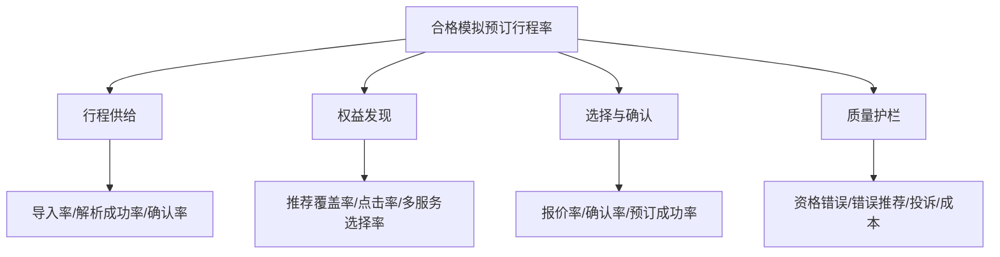

# Voyage Copilot 埋点与实验方案

## 1. 指标树

**北极星指标：** 已确认行程中，成功完成至少一项合格模拟服务预订的行程比例。

## 2. 核心指标口径

| 指标 | 分子 | 分母 | 窗口/去重 |
|---|---|---|---|
| 解析成功率 | 生成可确认结果的导入任务 | 通过格式校验的导入任务 | 任务级，24小时 |
| 行程确认率 | 已确认行程 | 生成可确认结果的行程 | 行程级，7天 |
| 推荐覆盖率 | 至少1个合格推荐的已确认行程 | 请求推荐的已确认行程 | 行程级 |
| 推荐点击率 | 点击至少1项推荐的用户 | 有有效推荐曝光的用户 | 用户级，行程窗口 |
| 模拟预订转化率 | 成功预订用户 | 点击推荐用户 | 用户级，行程窗口 |
| AI独立解决率 | 无转人工且用户确认解决的会话 | 有明确任务的有效会话 | 会话级，24小时 |
| 有效引用覆盖率 | 含至少1个有效引用的需依据回答 | 全部需依据回答 | 回答级 |
| AHT | 人工接管到解决的有效处理时间 | 已解决人工工单 | 剔除等待用户时间 |
| 单次成功任务成本 | 成功任务模型+检索+工具成本 | 成功任务数 | 日/模型版本 |

资格准确率、引用正确率等质量指标来自带金标的评测或人工复核，不直接用点击行为替代。

## 3. 事件规范

公共字段：`event_id、event_name、event_version、occurred_at、received_at、tenant_id、anonymous_or_user_id、session_id、trip_id、conversation_id、experiment_assignments、client、locale、trace_id`。PII不得进入事件属性。

| 事件 | 触发时机 | 关键属性 |
|---|---|---|
| `trip_import_started` | 用户提交导入 | `source_type, file_type` |
| `trip_parse_completed` | 解析任务结束 | `status, duration_ms, segment_count, uncertain_field_count` |
| `trip_confirmed` | 确认成功 | `edit_count, time_to_confirm_ms` |
| `entitlement_viewed` | 权益详情有效展示 | `benefit_id, status` |
| `recommendation_run_completed` | 推荐返回 | `candidate_count, eligible_count, strategy_version, latency_ms` |
| `recommendation_exposed` | 卡片达到曝光标准 | `service_id, rank, reason_codes` |
| `recommendation_clicked` | 打开详情/加入时间线 | `service_id, rank, action` |
| `quote_created` | 报价成功 | `service_type, points, amount_minor, currency, ttl_seconds` |
| `booking_confirmation_viewed` | 确认摘要完整展示 | `quote_id` |
| `booking_confirmed` | 用户明确确认 | `quote_id, confirmation_method` |
| `mock_booking_completed` | 模拟订单结束 | `status, failure_code` |
| `ai_answer_rendered` | 答案完整展示 | `intent, citation_count, model_version, latency_ms` |
| `ai_answer_feedback` | 点赞/点踩 | `value, reason_code` |
| `handoff_requested` | 触发转人工 | `trigger, risk_level` |
| `agent_takeover_started` | 客服接管 | `queue, wait_ms` |
| `ticket_resolved` | 工单解决 | `resolution_code, handle_ms` |
| `disruption_detected` | 模拟异常命中 | `type, severity, affected_order_count` |
| `resolution_option_accepted` | 用户接受方案 | `option_type` |

## 4. 漏斗

主漏斗：`trip_import_started → trip_parse_completed(success) → trip_confirmed → recommendation_exposed → recommendation_clicked → quote_created → booking_confirmed → mock_booking_completed(success)`。

每一步同时报告用户数、行程数、转化、耗时和流失原因。切分维度：权益来源、会员等级、机场、航站楼、服务类型、国内/境外、新老用户、AI推荐/主动搜索、正常/异常、单人/多人。

## 5. 流失原因分类

- 解析失败/字段不确定；
- 无权益/权益过期/余额不足；
- 无合格服务/时间不足/航站楼不匹配；
- 费用或点数不接受；
- 携伴/儿童规则不适合；
- 库存不足/报价过期；
- 用户暂不需要/仅查询；
- 系统错误/工具失败；
- 转人工/规则冲突；
- 未知（应持续降低）。

## 6. A/B实验

### 假设

基于已确认行程生成的AI权益推荐与时间线，相比传统服务列表，可以提高权益发现率和模拟预订转化，并降低任务耗时与客服咨询率。

### 设计

- 随机单位：用户，保证跨会话分组稳定；
- 对照组：传统服务列表，自行筛选；
- 实验组：导入行程后自动推荐+时间线；
- 核心指标：合格模拟预订行程率；
- 次要指标：发现率、点击、多服务选择、任务时间、咨询率、满意度；
- 护栏：资格错误、错误推荐、取消、投诉、退出、任务成本；
- 分层：新老用户、机场、会员计划、同行结构。

样本量在试点人数和基线明确后计算，提前定义最小可检测提升、显著性、把握度、最长周期和停止规则。虚拟数据与内部测试只能验证流程方向，不能宣称真实商业提升。

### 自动停止

出现任何跨租户泄露、未经确认写操作或系统性资格错误立即停止；投诉、错误推荐或成本超过预设阈值时暂停扩量并评审。

## 7. 数据质量

- 客户端事件带唯一ID，服务端去重；交易结果使用服务端事件为准；
- 每日校验事件量、空值、迟到、漏斗逆序和客户端/服务端差异；
- 指标SQL或语义层版本化并有Owner；
- 看板显示数据更新时间、定义和筛选；
- 实验分组在曝光前固定，避免事后挑选；
- 删除请求同步处理分析标识与可关联数据。

