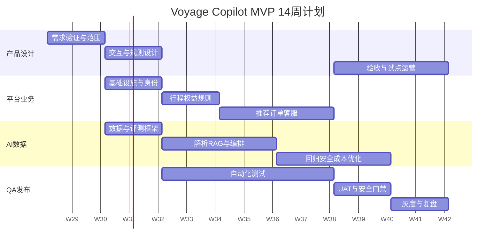

# Voyage Copilot 交付路线图

## 1. 项目基线

- 周期：14周；迭代：1周；
- 推荐团队：产品1、设计1、前端2、后端2、AI 1—2、QA 1、数据/SRE各0.5；
- 交付环境：dev、test、staging、production；
- 工作方式：每周计划/演示/复盘，双周范围评审，每周AI质量会。

## 2. 里程碑

| 阶段 | 周期 | 核心交付 | 退出条件 |
|---|---|---|---|
| M0 需求验证 | W1—2 | 访谈、流程、指标、范围、低保真 | P0冻结、决策Owner明确 |
| M1 产品技术设计 | W3—4 | 高保真、ERD、OpenAPI、规则、评测框架、CI | 空壳端到端跑通 |
| M2 行程与权益 | W5—6 | 身份、导入、确认、权益、服务、规则V1 | 导入到资格判断跑通 |
| M3 推荐与AI | W7—8 | 推荐、RAG、对话、只读工具、降级 | 推荐可解释、回答有引用 |
| M4 订单与三端 | W9—10 | 报价确认、订单、客服、运营、P1演示 | 主链路完整，写门禁有效 |
| M5 验证试点 | W11—12 | 500评测、安全、E2E、性能、UAT、Runbook | 所有上线门禁通过 |
| M6 灰度复盘 | W13—14 | 灰度、A/B、监控、复盘、V1.1计划 | Go/No-Go与复盘完成 |

## 3. 工作流并行计划

日期为根据当前时间生成的示例基线，正式启动时按实际Kickoff顺延。

## 4. 前10个工作日

| 日 | 动作 | Owner | 输出 |
|---:|---|---|---|
| D1 | Kickoff、Owner和范围机制 | 产品负责人 | 项目章程 |
| D2 | 用户/客服/异常服务蓝图工作坊 | 产品+设计 | 流程与问题清单 |
| D3 | 访谈启动、虚拟数据边界 | 产品+数据 | 访谈记录/数据规范 |
| D4 | 规则输入输出和指标口径 | 产品+后端+数据 | 规则/指标字典 |
| D5 | 低保真测试与P0冻结 | 设计+产品 | 原型结论 |
| D6 | 技术栈/模型/存储ADR | 架构+AI | ADR草案 |
| D7 | 工具、确认、幂等、审计评审 | 后端+安全 | 契约草案 |
| D8 | 评测集与知识元数据规范 | AI+运营+QA | 数据模板 |
| D9 | CI、环境、Trace和空壳链路 | 工程团队 | 技术骨架 |
| D10 | 容量、依赖、迭代1计划 | 全体 | Sprint backlog |

## 5. 团队职责

| 交付 | Accountable | Responsible | Consulted |
|---|---|---|---|
| 产品范围与指标 | 产品负责人 | 产品经理 | 业务、数据、研发 |
| 体验与设计系统 | 设计负责人 | UX/UI | 产品、前端、客服 |
| 规则与订单 | 后端负责人 | 后端 | 产品、运营、QA |
| AI/RAG/评测 | AI负责人 | AI工程师 | 安全、运营、QA |
| 三端前端 | 前端负责人 | 前端 | 设计、产品、QA |
| 测试与门禁 | QA负责人 | QA/测试开发 | 全体工程角色 |
| 埋点与实验 | 数据负责人 | 数据分析 | 产品、前后端 |
| 部署与事件响应 | 工程负责人 | SRE/后端 | 安全、QA |

## 6. 关键依赖

- W1前：业务Owner、试点用户和客服访谈资源；
- W2前：示范机场、服务品类、登录方式和语言决策；
- W3前：模型、对象存储、数据库和OIDC可用；
- W4前：20条黄金规则、150条评测样本、服务种子数据；
- W6前：全部P0规则和300条评测样本；
- W8前：500条评测样本、客服SLA和运营审核人；
- W10前：试点名单、支持与安全响应机制。

## 7. 风险与管理动作

| 风险 | 触发信号 | 动作 |
|---|---|---|
| 范围膨胀 | P1阻塞P0、页面持续新增 | 变更评审，P1不进入关键路径 |
| 规则不稳定 | 金标不一致、频繁冲突 | 规则Owner、测试先行、双人审核 |
| AI指标不达标 | 隐藏集回归、无依据回答 | 降低自动化、增加结构化流程 |
| 外部依赖延迟 | 模型/身份/存储未就绪 | 适配器+Mock，保持主链路开发 |
| 安全缺陷 | 越权/泄露/未确认写成功 | 立即停止灰度和修复 |
| 团队容量不足 | W4吞吐低于计划20% | 首先下调P1，不牺牲QA和安全 |

## 8. 发布策略

内部员工 → 受邀测试 → 5% → 20%。每阶段至少观察一个完整工作日和核心任务样本。功能开关独立控制AI推荐、模型版本、写工具、异常能力和双语。出现P0事件立即关闭相关写工具，降级到结构化查询和人工入口。

## 9. Definition of Done

代码/配置评审通过；单元、契约、集成和E2E通过；AI影响已跑对应评测；权限、审计、埋点、错误和可访问性完成；OpenAPI/文档更新；可观测和告警可用；上线/回滚方式明确；产品与QA验收。

