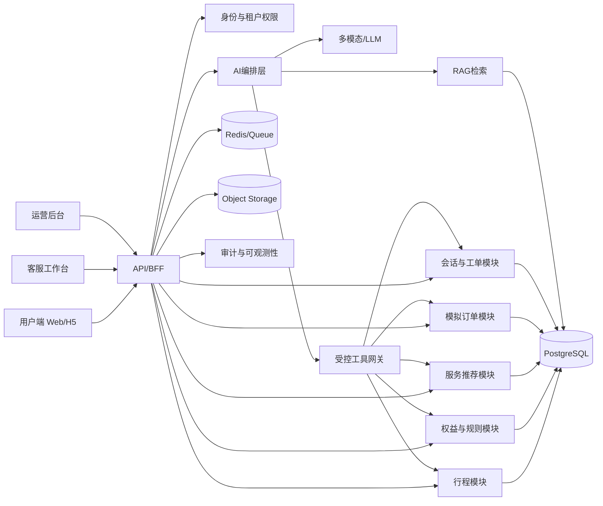

# Voyage Copilot 项目执行蓝图

> 基于《Voyage Copilot 产品需求文档 V1.1》整理。用于MVP立项、架构设计、迭代排期、任务拆分和上线验收。

## 1. 执行摘要

### 1.1 MVP要验证的核心闭环

MVP只聚焦一条主链路：

```text
导入行程 → 用户确认 → 查询权益 → 规则判定 → 推荐服务
→ 展示依据 → 用户二次确认 → 创建模拟订单 → 客服可接管
```

上线成功不是“页面全部完成”，而是以下四件事同时成立：

1. 行程关键字段提取准确且不确定内容必经用户确认；
2. 资格、计费、点数和交易限制全部由确定性规则给出；
3. AI回答有来源，交易操作有确认，所有调用可审计；
4. 用户、客服和运营三端形成完整数据闭环。

### 1.2 建议范围决策

PRD同时把异常履约列入MVP功能和V1.1路线，建议按以下方式消除冲突：

| 范围 | MVP | V1.1 |
|---|---|---|
| 异常事件 | 后台注入模拟事件 | 接入航变/供应商事件流 |
| 影响分析 | 识别受影响订单 | 实时批量影响分析 |
| 处理建议 | 保留、替代、取消建议 | 自动生成并排序多方案 |
| 订单操作 | 用户确认后模拟操作 | 完整改订/取消编排与补偿 |
| 失败处理 | 自动建工单、人工接管 | 自动重试、幂等与复杂恢复 |

### 1.3 MVP优先级

- **P0（必须上线）：** 行程解析与确认、权益查询、规则引擎、推荐、带引用问答、模拟预订、客服摘要与接管、规则/知识基础管理、审计、埋点、离线评测。
- **P1（时间允许）：** 多服务时间线、异常事件演示闭环、运营质量页、站内提醒、双语基础能力。
- **P2（后续）：** 自动改订、语音、多渠道通知、真实供应商、支付/扣点、供应链预测、企业报告。

## 2. 产品范围与页面收敛

### 2.1 用户端

将10个页面收敛成6个可交付路由，减少导航和重复状态：

| 路由 | 合并能力 | MVP级别 |
|---|---|---|
| `/` | 首页、最近行程、入口 | P0 |
| `/trips/import` | 上传、文本、航班号、手工录入 | P0 |
| `/trips/:id` | 行程确认、推荐、时间线 | P0/P1 |
| `/copilot` | AI对话、引用卡片、工具进度 | P0 |
| `/benefits` | 权益中心、规则详情 | P0 |
| `/orders/:id` | 确认、结果、订单详情、异常方案 | P0/P1 |

### 2.2 客服端

| 路由 | 核心能力 | MVP级别 |
|---|---|---|
| `/agent/conversations` | 队列、筛选、SLA、风险标识 | P0 |
| `/agent/conversations/:id` | 摘要、上下文、接管、回复 | P0 |
| `/agent/tickets/:id` | 工单、证据、订单操作记录 | P0 |

### 2.3 运营端

| 路由 | 核心能力 | MVP级别 |
|---|---|---|
| `/admin/dashboard` | 漏斗、AI质量、成本 | P1 |
| `/admin/knowledge` | 文档、版本、有效期、审核 | P0 |
| `/admin/rules` | 规则编辑、测试、发布、回滚 | P0 |
| `/admin/services` | 服务、库存、供应商状态 | P0 |
| `/admin/quality` | 低置信度、差评、失败调用 | P1 |

## 3. 系统架构

### 3.1 架构原则

1. **模块化单体优先：** MVP避免微服务运维成本，模块边界和事件接口为后续拆分做准备。
2. **LLM不拥有业务真相：** 模型负责理解、提取、解释和编排；规则、价格、库存和状态来自业务服务。
3. **读写分离思维：** 查询工具可自动执行；任何订单写操作必须经过确认令牌。
4. **全链路可追溯：** 保存输入、检索文档版本、命中规则、工具参数、确认记录和最终输出。
5. **多租户默认隔离：** 每个业务表、检索过滤和缓存键都带 `tenant_id`。

### 3.2 推荐技术栈

| 层级 | 建议选型 | 原因 |
|---|---|---|
| 前端 | Next.js + TypeScript + Tailwind + React Query | 三端复用组件，适合Web/H5和管理台 |
| 后端 | Python FastAPI模块化单体 | AI/RAG生态成熟，接口和异步任务开发快 |
| 数据库 | PostgreSQL + pgvector | 事务数据、规则版本和向量检索统一管理 |
| 缓存/队列 | Redis + Celery/Dramatiq | 解析、文档入库、提醒和评测异步化 |
| 对象存储 | S3兼容存储 | 行程图片、知识文档、评测产物 |
| 身份权限 | OIDC + RBAC + tenant scope | 用户、客服、运营、审核员分权 |
| 可观测性 | OpenTelemetry + 日志/指标/Trace平台 | 串联对话、规则、工具和模型调用 |
| 部署 | Docker + 托管容器平台 | MVP降低集群维护负担 |

最终云厂商、模型供应商和消息渠道应在第2周形成ADR，不在业务代码中硬编码。

### 3.3 逻辑架构



### 3.4 建议代码仓库结构

```text
voyage-copilot/
├── apps/
│   ├── web/                  # 用户端
│   ├── agent-console/        # 客服端
│   ├── admin-console/        # 运营端
│   ├── api/                  # FastAPI业务与AI编排
│   └── worker/               # 异步任务
├── packages/
│   ├── ui/                   # 共享设计系统
│   ├── contracts/            # OpenAPI生成类型/事件契约
│   ├── analytics/            # 埋点SDK
│   └── config/               # lint、格式化、环境配置
├── data/
│   ├── seeds/                # 虚拟业务数据
│   └── evals/                # 500条离线评测集
├── docs/
│   ├── adr/                  # 架构决策记录
│   ├── api/                  # 接口说明
│   ├── product/              # 流程与验收
│   └── runbooks/             # 发布与故障手册
├── infra/                    # 容器、迁移、部署配置
└── tests/                    # 端到端与安全测试
```

## 4. 领域模块与职责边界

| 模块 | 核心职责 | 不负责 |
|---|---|---|
| Identity/Tenant | 登录、角色、租户和数据范围 | 业务资格 |
| Trip | 导入、OCR/多模态解析、确认、多航段 | 猜测缺失字段 |
| Benefit | 用户权益、余额、有效期、计划 | 自然语言解释 |
| Rule Engine | 资格、费用、携伴、儿童、取消、互斥 | 推荐文案 |
| Service Catalog | 服务点、营业时间、库存、位置 | 用户资格 |
| Recommendation | 硬过滤、评分、理由数据 | 绕过规则推荐 |
| Timeline | 服务耗时、步行、缓冲、冲突检测 | 真实地图导航 |
| Knowledge/RAG | 文档入库、过滤、检索、引用 | 资格最终裁决 |
| Copilot | 意图、澄清、工具编排、答案生成 | 直接写数据库 |
| Order | 预订单、确认、状态机、虚拟点数台账 | 真实支付 |
| Disruption | 模拟异常、影响分析、方案建议 | MVP自动补偿 |
| Support | 摘要、接管、工单、SLA | 自主赔偿 |
| Analytics/Eval | 埋点、漏斗、质量和成本 | 修改业务事实 |

## 5. 核心业务设计

### 5.1 行程状态机

```text
DRAFT → PARSING → NEEDS_CONFIRMATION → CONFIRMED → ACTIVE → COMPLETED
                  ↘ PARSE_FAILED
ACTIVE → DISRUPTED → ACTIVE/CANCELLED
```

- 原始图片、模型原始输出和标准化结果分开保存；
- 每个字段保存 `value / confidence / source / confirmed_by_user`；
- 航班号、机场、日期时间任一关键字段未确认时，禁止进入订单确认；
- 时间统一存UTC，同时保存机场时区和原始本地时间。

### 5.2 规则引擎

规则采用版本化、可测试的结构化表达，而不是自然语言Prompt。建议输入输出：

```json
{
  "input": {
    "tenant_id": "tenant_demo_01",
    "user_id": "user_001",
    "trip_segment_id": "seg_001",
    "benefit_id": "benefit_lounge_01",
    "service_id": "service_001",
    "party": {"adults": 1, "children": 1}
  },
  "output": {
    "eligible": true,
    "points": 1,
    "extra_fee": 80,
    "currency": "CNY",
    "reason_codes": ["MEMBERSHIP_ACTIVE", "CHILD_EXTRA_FEE"],
    "matched_rule_versions": ["rule_17@3"],
    "evaluated_at": "timestamp"
  }
}
```

规则发布流程：草稿 → 自动测试 → 双人审核 → 定时/立即发布 → 监控 → 回滚。订单必须保存规则快照，不能只保存规则ID。

### 5.3 推荐算法

MVP采用“硬过滤 + 可解释加权排序”，暂不上机器学习排序：

1. 硬过滤：资格、航站楼、营业时间、库存、最小服务时长、规则有效期；
2. 特征评分：时间适配30%、用户偏好20%、费用/点数15%、履约质量15%、步行距离10%、库存稳定性10%；
3. 多样性约束：同类服务默认最多展示3项；
4. 输出原因码，由前端模板或AI转成自然语言；
5. 每次曝光记录候选集、过滤原因、分数和策略版本。

### 5.4 旅程时间线

时间线使用确定性约束求解：

- 到达机场缓冲；
- 值机/托运耗时；
- 安检耗时；
- 服务持续时间；
- 服务点到登机口步行时间；
- 国内/国际航班最晚到达登机口时间；
- 儿童、无障碍和减少步行偏好产生额外缓冲。

任何冲突应返回结构化冲突原因和可调整项，AI只负责解释和提出选项。

### 5.5 模拟订单状态机与确认门

```text
DRAFT → QUOTED → AWAITING_CONFIRMATION → CONFIRMED → FULFILLED
                   ↘ EXPIRED              ↘ CHANGE_PENDING → CONFIRMED
                                           ↘ CANCELLED
                                           ↘ MANUAL_REVIEW
```

写操作执行前：

1. 重新检查资格和库存；
2. 返回报价及不可变摘要哈希；
3. 前端明确展示点数、费用和取消规则；
4. 用户确认生成一次性 `confirmation_token`；
5. 工具网关校验令牌、用户、动作、摘要和有效期；
6. 使用幂等键执行，记录审计日志。

## 6. AI与RAG落地方案

### 6.1 AI编排流程

```text
请求分类 → 权限/租户上下文 → 实体提取 → 缺失信息判断
→ 只读工具/RAG → 规则验证 → 答案或方案生成
→ 引用与置信度校验 → 风险策略 → 返回/转人工
```

不要在MVP构建完全自主Agent。采用有限状态工作流，允许模型在白名单工具中选择，但由服务端验证每个参数和前置条件。

### 6.2 工具契约分级

| 风险级别 | 工具 | 执行策略 |
|---|---|---|
| R0 | 查询行程、权益、服务、库存、规则 | 权限通过后自动执行 |
| R1 | 创建预订单、生成异常方案 | 自动执行，不改变最终状态 |
| R2 | 确认、修改、取消模拟订单 | 必须有匹配的确认令牌 |
| R3 | 赔偿、真实退款、改会员资格 | MVP禁用并转人工 |

所有工具统一返回 `success/error_code/data/source_versions/trace_id`，模型不得解析不稳定的自由文本错误。

### 6.3 RAG索引与检索

- 文档切分单位优先使用“规则条款/服务说明”，而非固定字符数；
- 元数据至少包含 `tenant_id、plan_id、airport、terminal、service_type、locale、effective_from、effective_to、version、approval_status`；
- 检索顺序：权限过滤 → 有效期过滤 → 关键词+向量混合检索 → 重排 → 规则验证；
- 引用展示文档标题、条款、版本、生效时间和更新时间；
- 若无有效证据、证据冲突或低于阈值，禁止生成确定性结论；
- 对用户输入、上传文档和检索内容做Prompt注入隔离，文档内容永远不拥有工具授权。

### 6.4 置信度与转人工

不要只依赖模型自报置信度。组合以下信号：

- 是否存在有效结构化数据；
- 检索分数和证据一致性；
- 规则是否唯一命中；
- 工具调用是否成功；
- 行程关键字段是否确认；
- 是否涉及投诉、赔偿、身份失败或订单冲突；
- 同一意图连续失败次数。

满足强制转人工条件时，系统应停止后续写操作并生成结构化工单。

## 7. 数据模型

### 7.1 核心表

| 领域 | 主要表 |
|---|---|
| 租户与身份 | `tenants, users, user_identities, roles, consents` |
| 行程 | `trips, trip_segments, travelers, trip_source_files, trip_field_evidence` |
| 权益 | `benefit_plans, benefits, user_entitlements, entitlement_ledger` |
| 规则 | `rules, rule_versions, rule_test_cases, rule_evaluations` |
| 服务 | `suppliers, service_locations, services, service_schedules, inventory_snapshots` |
| 推荐 | `recommendation_runs, recommendation_candidates, recommendation_feedback` |
| 知识 | `knowledge_documents, knowledge_versions, knowledge_chunks, citations` |
| 会话 | `conversations, messages, model_runs, tool_calls, handoffs` |
| 订单 | `orders, order_items, order_status_history, order_rule_snapshots, confirmations` |
| 异常 | `disruption_events, affected_orders, resolution_options, resolution_actions` |
| 客服 | `tickets, ticket_events, assignments, sla_policies` |
| 分析审计 | `analytics_events, audit_logs, eval_runs, eval_results` |

### 7.2 数据约束

- 业务主表必须有 `tenant_id、created_at、updated_at、version`；
- 状态改变使用乐观锁，订单写操作使用幂等键；
- PII字段加密，检索索引不保存不必要的联系方式和证件信息；
- 审计日志追加写，禁止普通管理员修改；
- 虚拟点数使用台账，不直接更新一个余额字段；
- 删除请求采用可审计的异步擦除流程，并处理对象存储、缓存和索引副本。

## 8. API与事件清单

### 8.1 P0 API组

| API组 | 代表接口 |
|---|---|
| Trips | `POST /trips/import`、`GET/PATCH /trips/{id}`、`POST /trips/{id}/confirm` |
| Benefits | `GET /me/entitlements`、`POST /eligibility/evaluate` |
| Services | `GET /services/search`、`GET /services/{id}/availability` |
| Recommendations | `POST /trips/{id}/recommendations` |
| Copilot | `POST /conversations`、`POST /conversations/{id}/messages` |
| Orders | `POST /orders/quote`、`POST /orders/{id}/confirmation-token`、`POST /orders/{id}/confirm` |
| Support | `POST /handoffs`、`POST /tickets`、`GET /agent/conversations/{id}/summary` |
| Admin | 知识、规则、服务的草稿/审核/发布/回滚接口 |
| Analytics | `POST /events/batch`、运营聚合查询 |

接口契约以OpenAPI为单一来源，前端类型自动生成；所有写接口支持幂等键与Trace ID。

### 8.2 领域事件

`trip.parsed`、`trip.confirmed`、`recommendation.generated`、`order.quoted`、`order.confirmed`、`order.cancelled`、`disruption.detected`、`handoff.requested`、`ticket.created`、`knowledge.published`、`rule.published`。

MVP可以使用数据库Outbox加异步Worker，避免过早引入独立消息平台。

## 9. 分阶段实施计划（14周）

### 阶段0：项目启动与需求验证（第1—2周）

交付物：

- 8—12名会员用户访谈、5—8名客服/运营访谈；
- 现状服务蓝图、MVP主流程、异常流程和权限矩阵；
- 低保真原型及5人可用性测试；
- 指标口径、事件字典、风险台账；
- ADR-001技术栈、ADR-002模型策略、ADR-003租户隔离。

退出条件：MVP边界签字；P0场景无流程空白；指标均有数据来源和负责人。

### 阶段1：产品与技术设计（第3—4周）

交付物：

- 高保真主流程和设计系统；
- OpenAPI初稿、ERD、状态机、工具契约；
- 规则DSL与20条黄金规则；
- 知识元数据规范与首批文档；
- 500条评测集框架，至少150条已标注；
- CI、开发/测试环境、日志与Trace骨架。

退出条件：关键接口评审通过；规则可自动测试；一条端到端“空壳链路”在测试环境跑通。

### 阶段2：MVP开发（第5—10周）

#### 第5—6周：行程与权益基础

- 登录、租户/RBAC、授权；
- 行程上传、解析、字段证据和确认；
- 用户权益中心、服务目录和虚拟数据；
- 规则引擎V1及资格判断；
- 核心埋点、审计和错误码。

验收：行程导入到资格判断端到端跑通；任何未确认行程无法下单。

#### 第7—8周：推荐、RAG与对话

- 服务硬过滤和排序；
- 知识入库、混合检索、引用；
- AI有限状态编排与只读工具；
- 对话界面、澄清、降级、转人工触发；
- 评测集扩充到350条。

验收：推荐结果可解释；资格问答100%来自规则输出；有效回答100%带引用。

#### 第9—10周：订单与三端闭环

- 报价、确认令牌、模拟订单、虚拟点数台账；
- 客服队列、摘要、工具记录、接管、工单；
- 规则和知识基础管理；
- 时间线P1、异常演示闭环P1；
- 数据看板基础指标。

验收：完整主链路可演示；未确认写操作在API层被拒绝；客服可见完整上下文。

### 阶段3：测试与试点（第11—12周）

- 500条离线评测全量执行；
- 权限、越权、Prompt注入、PII、幂等和并发测试；
- 浏览器端到端、性能、可访问性和中英文关键路径测试；
- 10—20名目标用户可用性测试；
- 客服演练、故障演练、回滚演练；
- P0/P1缺陷清零和上线评审。

退出条件：满足第12节上线门禁；运营、客服和技术值班手册完成。

### 阶段4：灰度与效果分析（第13—14周）

- 先内部人员，再5%，最后20%虚拟用户灰度；
- 启动传统列表与AI推荐A/B实验；
- 每日查看错误推荐、资格错误、转人工、成本和投诉；
- 输出漏斗、失败案例、模型/规则改进清单；
- Go/No-Go评审及V1.1异常履约计划。

## 10. Epic与验收拆分

| Epic | 主要Story | 完成定义 |
|---|---|---|
| E1 行程导入 | 多输入、解析、证据、修改、确认 | 关键字段准确率达标；不确定字段必确认 |
| E2 权益中心 | 权益列表、余额、适用范围、规则详情 | 数据隔离；状态与有效期正确 |
| E3 规则引擎 | 资格、携伴、儿童、费用、取消 | 黄金测试100%；记录规则版本和输入快照 |
| E4 服务推荐 | 候选、硬过滤、排序、理由 | 禁止项0曝光；可复现策略结果 |
| E5 Copilot/RAG | 问答、澄清、引用、降级 | 引用覆盖100%；无证据不下结论 |
| E6 时间线 | 多服务组合、缓冲、冲突 | 冲突可检测、解释和重算 |
| E7 模拟订单 | 报价、确认、创建、取消 | 所有R2操作确认覆盖100%；幂等 |
| E8 客服工作台 | 队列、摘要、接管、工单 | 上下文完整；强制场景全部转人工 |
| E9 运营后台 | 知识、规则、服务、质量 | 审核发布、版本、回滚、审计可用 |
| E10 数据与评测 | 埋点、看板、数据集、评测 | 指标可复算；500条数据版本化 |
| E11 安全与平台 | RBAC、租户、PII、可观测性 | 越权成功0；关键链路可追踪 |

建议每个Story都包含：用户价值、前置条件、主/异常流程、数据权限、埋点、审计、可访问性、测试案例和明确的非范围。

## 11. 团队配置与协作

### 11.1 推荐配置（8—10人）

| 角色 | 人数 | 主要责任 |
|---|---:|---|
| 产品负责人/产品经理 | 1 | 范围、流程、指标、验收 |
| UX/UI | 1 | 三端体验、设计系统、可用性测试 |
| 前端工程师 | 2 | 用户端、客服/运营端 |
| 后端工程师 | 2 | 领域服务、规则、订单、权限 |
| AI工程师 | 1—2 | 解析、RAG、编排、评测与安全 |
| QA/测试开发 | 1 | 自动化、评测、安全与性能 |
| 数据/分析 | 0.5—1 | 埋点、实验、看板和成本 |
| DevOps/SRE | 0.5 | CI/CD、环境、观测、演练 |

精简团队可由后端兼平台、AI兼数据，但产品验收和QA职责不能省略。

### 11.2 工作节奏

- 一周一个迭代，周一计划、每日15分钟同步、周五演示与复盘；
- PRD、设计、API、规则和评测集全部版本化；
- 每个Epic设产品、研发、QA三方Owner；
- 每周一次AI质量会：Top失败、转人工、错误引用、成本；
- 每两周一次范围检查，P1不得挤占P0上线门禁。

## 12. 测试、评测与上线门禁

### 12.1 测试金字塔

- 单元测试：规则、状态机、时间计算、权限策略、排序；
- 契约测试：OpenAPI、Agent工具、模型结构化输出；
- 集成测试：数据库、向量检索、对象存储、队列；
- 端到端测试：行程到订单、异常到工单、运营发布到用户引用；
- 离线AI评测：解析、问答、澄清、异常、安全、无答案；
- 线上评测：抽样人工复核、用户反馈、A/B实验和影子评测。

### 12.2 硬性上线门禁

| 门禁 | 标准 |
|---|---:|
| 行程解析成功率 | ≥95% |
| 关键字段准确率 | ≥98% |
| 权益资格准确率 | ≥99.5% |
| 点数/费用计算 | 100% |
| 有效回答引用覆盖 | 100% |
| 高风险操作确认覆盖 | 100% |
| 越权工具调用成功 | 0 |
| 跨租户数据泄露 | 0 |
| P0安全问题 | 0 |
| 核心查询可用性 | ≥99.9% |

“未经确认执行交易次数为0”应在工具网关做技术强制，不能只靠Prompt和测试保证。

### 12.3 性能预算

- 普通问答3秒：首屏先返回意图/检索进度，流式生成答案；
- 推荐5秒：规则和库存并发查询，预计算服务静态特征；
- 工具8秒：超时、重试和幂等由工具网关统一处理；
- 文档解析、批量评测和提醒必须进入异步队列；
- 每个接口定义P50/P95/P99和错误率告警。

## 13. 指标与实验设计

### 13.1 北极星与护栏

- **北极星指标：** 已确认行程中，成功完成至少一项合格模拟服务预订的比例；
- **核心漏斗：** 导入 → 解析成功 → 确认 → 推荐曝光 → 点击 → 报价 → 确认 → 成功；
- **AI指标：** 独立解决率、正确引用率、无依据回答率、工具成功率、平均成本；
- **护栏：** 资格错误、错误推荐、取消、投诉、转人工、跨租户访问、未经确认写操作。

每个指标需在第2周确定：分子、分母、去重方式、观察窗口、排除条件、数据延迟和Owner。

### 13.2 A/B实验

- 随机单位建议使用用户，避免同一用户跨组污染；
- 实验前定义最小可检测提升、样本量和最长运行周期；
- 对照组为传统服务列表，实验组为行程推荐+时间线；
- 新老用户、机场、会员计划和单/多人行程做分层检查；
- 资格错误、投诉或跨租户问题触发实验自动停止；
- MVP虚拟数据阶段结论只说明体验和行为方向，不能外推真实商业收益。

## 14. 安全、隐私与治理

### 14.1 权限矩阵

- 会员：仅访问本人行程、权益、订单、对话；
- 客服：按队列/租户/授权访问，默认遮蔽敏感字段；
- 运营编辑：创建草稿，无发布权限；
- 审核员：审核并发布规则/知识；
- 平台管理员：配置租户，不默认读取业务内容；
- AI工具身份：最小权限、短期令牌、工具级scope。

### 14.2 必做安全控制

- 上传文件类型、大小、恶意内容扫描；
- Prompt注入测试和检索内容边界标记；
- 服务端参数重建，不能信任模型提供的 `tenant_id/user_id`；
- 日志脱敏，禁止记录完整联系方式、凭证和原始敏感文件；
- 密钥进入密钥管理服务，禁止进入仓库；
- 限流、反重放、CSRF/XSS/SQL注入防护；
- 数据保留和删除策略可配置；
- 规则/知识/订单/客服操作全部留审计记录。

## 15. 虚拟数据计划

按依赖顺序生成，并保持引用一致性：

1. 20个机场、航站楼和时区；
2. 8个会员计划、200条版本化权益规则；
3. 60个贵宾室、40个餐厅、20个接送/礼宾服务；
4. 1000名用户及其权益台账；
5. 行程、库存、2000条订单和300条异常记录；
6. 500条评测样本及标准答案、证据、期望工具和风险标签。

数据生成器必须固定随机种子、通过外键和业务一致性校验，并明确声明全部为虚拟数据。

## 16. 风险台账与触发条件

| 风险 | 早期信号 | 应对与Owner |
|---|---|---|
| MVP范围膨胀 | P1进入关键路径、页面持续新增 | 产品负责人冻结P0，变更走评审 |
| 规则准确率不达标 | 同一输入结果不稳定、规则冲突 | 后端/运营补黄金用例与发布门禁 |
| 行程图片质量差 | 低清/遮挡样本失败集中 | AI工程师增加质量检测和手工降级 |
| RAG错误引用 | 过期或跨租户文档被召回 | AI/安全强化元数据过滤和有效期校验 |
| 模型或工具延迟 | P95超预算 | 并行查询、缓存、流式、超时降级 |
| 测试集污染 | 调参时反复看最终测试集 | 划分开发/验证/隐藏测试集 |
| 运营无法维护规则 | 发布依赖研发、无回滚 | 提前交付规则测试台和审核流程 |
| 模拟结果被误认为真实 | 用户误解订单/点数 | 全局醒目标识、虚拟凭证和免责说明 |
| 跨租户泄露 | 查询缺少tenant过滤 | 数据层强制策略+越权自动化测试 |
| 成本失控 | 单任务Token/重试持续上涨 | 模型路由、上下文预算、缓存和成本告警 |

## 17. 上线与运维

### 17.1 环境

`local → dev → test → staging → production`；测试和生产使用不同租户、存储桶、密钥和模型项目。生产迁移必须可回滚，种子数据不得自动进入生产。

### 17.2 灰度与回滚

- 功能开关控制AI推荐、写工具、异常闭环和模型版本；
- 新Prompt、模型、规则和检索策略先影子运行，再小流量；
- 可独立回滚前端、应用、规则、知识和模型配置；
- 降级页提供结构化权益查询、服务列表和人工入口；
- P0事件包括跨租户访问、未经确认写操作、资格系统性误判和订单状态损坏。

### 17.3 必备Runbook

模型不可用、向量检索不可用、规则冲突、订单状态不一致、队列积压、对象存储失败、跨租户告警、成本异常、Prompt注入事件、数据删除请求。

## 18. 立项后前10个工作日

| 日程 | 必须完成的动作 |
|---|---|
| D1 | 任命Owner，确认MVP/P1/P2和决策机制 |
| D2 | 主链路、异常链路、租户权限工作坊 |
| D3 | 用户/客服访谈启动，建立风险台账 |
| D4 | 数据模型、规则输入输出、指标口径工作坊 |
| D5 | 低保真原型评审，冻结首批P0场景 |
| D6 | 技术栈与模型/存储ADR评审 |
| D7 | 工具契约、确认令牌和审计方案评审 |
| D8 | 评测集规范、知识元数据和虚拟数据规范 |
| D9 | 端到端空壳链路及CI方案评审 |
| D10 | 里程碑基线、人员容量和第一个开发迭代计划 |

## 19. 开工前必须确认的产品决策

以下问题不阻塞本规划，但必须在第2周前冻结：

1. 首发机场/地区以及是否包含高铁；
2. 首发服务品类是否同时包含接送机；
3. 登录和虚拟会员身份如何绑定；
4. 使用哪类模型及数据驻留要求；
5. 是否需要真实航班状态数据，还是完全模拟；
6. 客服SLA、队列和主管升级规则；
7. 通知仅站内，还是包含短信/邮件/企业渠道；
8. 中英文是否都作为上线门禁；
9. 虚拟点数和模拟订单的用户告知方式；
10. A/B实验所需样本来自内部测试还是真实试点用户。

## 20. 最终交付清单

- 三端可运行产品和部署配置；
- OpenAPI、ERD、状态机、工具契约和架构ADR；
- 版本化规则、知识库和虚拟数据生成器；
- 500条离线评测集、评测报告和安全测试报告；
- 埋点字典、运营看板和A/B实验方案；
- 客服操作手册、运营发布手册和故障Runbook；
- 上线评审记录、灰度报告、MVP复盘和V1.1 Backlog。

---

这份计划的核心原则是：先证明“准确识别—可靠判断—可解释推荐—安全确认—人工兜底”闭环，再扩展自动异常履约、真实交易和供应链智能化。
